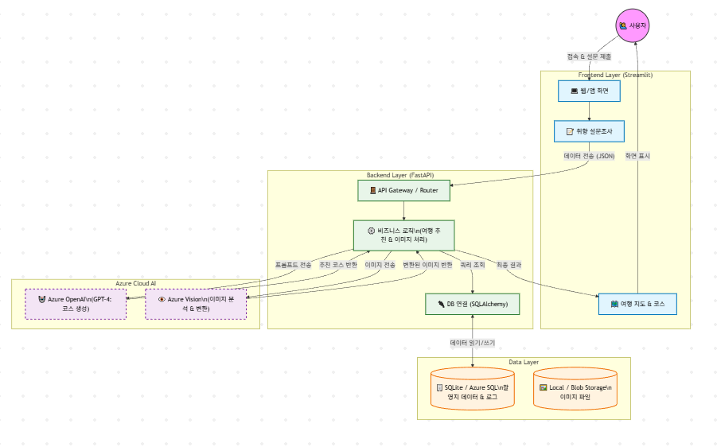

# KTrip: AI 기반 K-Culture 여행 큐레이션 및 콘텐츠 생성 플랫폼

## 1. 프로젝트 개요
**KTrip**은 사용자의 취향과 상황을 분석하여 최적의 K-Drama/Movie 촬영지 여행 코스를 추천하고, 여행 중 촬영한 사진을 SNS(Instagram, Blog) 감성에 맞게 AI로 변환하여 제공하는 서비스이다. Microsoft Azure 클라우드 인프라와 Azure OpenAI를 기반으로 구축된다.

---

## 2. 시스템 아키텍처 (System Architecture)
본 프로젝트는 확장성과 유지보수를 고려하여 **3-Tier Architecture**를 채택하였으며, AI 서비스 계층이 통합된 구조이다.

### 2.1. Frontend Layer
* **기술 스택:** Streamlit (Python)
* **역할:** 사용자 인터페이스(UI) 제공 및 데이터 수집.
* **주요 기능:**
    * 여행 취향 심층 설문(Basic Info, Travel Style, Interests, Food/Café, Photos).
    * AI가 생성한 여행 코스 및 지도 시각화.
    * 여행 사진 업로드 및 스타일 변환 결과 확인.

### 2.2. Backend Layer
* **기술 스택:** FastAPI (Python), SQLAlchemy
* **역할:** 비즈니스 로직 처리 및 데이터 입출력 관리.
* **주요 기능:**
    * RESTful API 제공.
    * 프론트엔드 요청 수신 및 데이터베이스 쿼리 수행.
    * Azure OpenAI 및 Vision API 연동을 통한 AI 서비스 중계.

### 2.3. Data Layer
* **Database:** SQLite (개발 단계) → Azure SQL Database (운영 단계 예정)
* **Storage:** Local Storage (개발 단계) → Azure Blob Storage (이미지 저장용 예정)
* **역할:** 정형 데이터(촬영지 정보, 사용자 로그) 및 비정형 데이터(이미지) 관리.

### 2.4. AI Service Layer
* **기술 스택:** Azure OpenAI Service (GPT-4), Azure Computer Vision (예정)
* **역할:**
    * 사용자 입력 프롬프트 기반 맞춤형 여행 코스 및 설명 생성.
    * 업로드된 이미지의 스타일 변환 및 캡션 생성.

---

## 3. 현재 구현 현황 (Current Status)

### 3.1. 백엔드 및 데이터베이스 구축
* **ORM 설정:** SQLAlchemy를 이용한 DB 연결 모듈(`database.py`) 구현 완료.
* **데이터 스키마 설계 (`models.py`):**
    * `Location`: 촬영지 기본 정보(장소명, 주소, 위경도, 미디어 정보, AI 요약).
    * `PhotoLog`: 사용자 업로드 이미지 경로 및 변환 로그 관리.
* **테스트 환경:** DB 생성 및 CRUD 테스트 스크립트(`test_db.py`) 작성 및 검증 완료.

### 3.2. 프론트엔드 프로토타입 개발
* **사용자 설문 UI 구현:** Streamlit을 활용하여 5단계 심층 설문 폼 구현 완료.
    1.  기본 여행 정보 (지역, 기간)
    2.  여행 스타일 (속도, 동행)
    3.  관심사 (K-Content 비중, 세부 장르)
    4.  식음료 취향 (음식, 카페)
    5.  사진 및 기록 선호도
* **데이터 연동 준비:** 설문 결과를 JSON 형태로 직렬화하여 백엔드 전송 준비 완료.

---

## 4. 향후 로드맵 (Roadmap)

### Phase 1: 핵심 기능 통합 (Current)
* [ ] 팀원별 정제 데이터(CSV)의 데이터베이스 적재 (ETL).
* [ ] Frontend와 Backend API 연동.
* [ ] Azure OpenAI API 연동을 통한 실제 여행 코스 생성 로직 구현.

### Phase 2: AI 기능 고도화
* [ ] 사용자 설문 기반 프롬프트 엔지니어링 최적화.
* [ ] 이미지 스타일 변환 기능 구현 .
* [ ] 경로 최적화 알고리즘 적용 (휴리스틱 or 위경도 최단거리계산).

### Phase 3: 클라우드 배포 및 최적화
* [ ] Azure 리소스 그룹 생성 및 클라우드 DB 마이그레이션.
* [ ] Docker Container 패키징 및 Azure Container Apps 배포.
* [ ] 전체 시스템 통합 테스트 및 버그 수정.

---

## 5. 프로젝트 구조 (Directory Structure)
```bash
KTrip/
├── ai/                  # AI 모델 실험 및 데이터 전처리 (Jupyter Notebook)
├── backend/             # 백엔드 서버 어플리케이션
│   └── app/
│       ├── main.py      # API Entry Point
│       ├── database.py  # DB 세션 관리
│       ├── models.py    # DB 스키마 정의
│       └── test_db.py   # DB 유닛 테스트
├── frontend/            # 프론트엔드 어플리케이션
│   └── app.py           # Streamlit 실행 파일
├── data/                # 원본 및 정제 데이터 저장소
└── README.md            # 프로젝트 명세서

```


